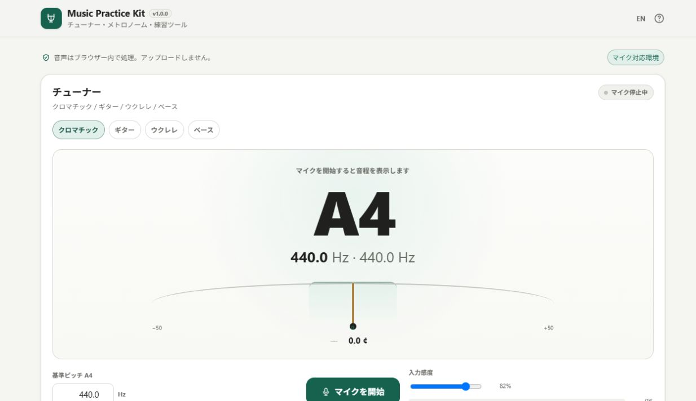

# Music Practice Kit

[](https://github.com/ttomohisa/htmlapps-music-practice-kit/actions/workflows/deploy-pages.yml)
[](LICENSE)
[](https://ttomohisa.github.io/htmlapps-music-practice-kit/)

[日本語版 README](README.ja.md)

A smartphone-first, single-HTML practice toolkit that combines the everyday tools musicians usually open as separate apps.

**Tuner, metronome, TAP BPM, drone tone, practice timer, recorder, and frequency spectrum** all run in one page. Microphone audio is processed locally in the browser and is not uploaded by the app.

Built as part of [Browser Kitty](https://browser-kitty.com/).

## 🚀 Live demo

### [Open Music Practice Kit on GitHub Pages](https://ttomohisa.github.io/htmlapps-music-practice-kit/)

GitHub Pages only serves the initial HTML. After the page loads, tuning analysis, metronome scheduling, drone generation, recording, spectrum analysis, and settings are handled on your device.



The tuner, recorder, and spectrum require microphone permission. The metronome, TAP BPM, drone, and timer can be used without microphone access.

## Features

- Chromatic tuner with large note, frequency, cents offset, and tuning needle
- Instrument presets:
  - Guitar: E2 / A2 / D3 / G3 / B3 / E4
  - High-G ukulele: G4 / C4 / E4 / A4
  - 4-string bass: E1 / A1 / D2 / G2
- Tap an instrument string to lock the tuner to a target note
- Adjustable A4 reference pitch from 430.0 to 450.0 Hz
- Input level and tuner sensitivity controls
- 30–300 BPM metronome
- ±1 / ±5 BPM controls and TAP BPM
- 2–7 beats per bar with optional first-beat accent
- Web Audio clock-based look-ahead scheduling for more stable timing
- C2–B5 drone tone with sine / triangle waveform selection
- 5 / 10 / 15 / 30 minute practice timer presets plus custom duration
- Screen Wake Lock during practice where the browser supports it
- Local microphone recording, playback, discard, and file download
- Real-time microphone frequency spectrum
- Japanese and English UI in the same HTML
- Smartphone-first layout with safe-area-aware bottom navigation
- No runtime CDN, analytics, telemetry, or external API request

## Quick start

### Use the web demo

Just [open the demo](https://ttomohisa.github.io/htmlapps-music-practice-kit/). No installation or account is required.

When the tuner, recorder, or spectrum is used for the first time, allow microphone access in the browser prompt.

### Use the downloaded HTML

1. Download `dist/index.html` from this repository or from a release artifact.
2. Open it in a current Chromium-based browser, Firefox, or Safari.
3. The metronome, TAP BPM, drone, and timer are available immediately.
4. If the browser does not allow microphone access from `file://`, use the GitHub Pages version or serve the file from HTTPS / localhost.

### Use it fully offline (advanced)

1. Download or clone this repository.
2. Double-click `build-standalone.bat` on Windows.
3. Copy the generated `dist/index.html` wherever you need it.
4. Open the single HTML later without a network connection.

This app currently has no third-party runtime dependency, so the build does not need to download an audio library. The application uses browser-native Web Audio, Media Capture, MediaRecorder, Canvas, and Wake Lock APIs.

## Usage

### Tuner

1. Open **Tuner** and allow microphone access.
2. Choose **Chromatic**, **Guitar**, **Ukulele**, or **Bass**.
3. Play a note and watch the large note name, frequency, cents offset, and needle.
4. In an instrument mode, tap a string to lock the target note when you want to tune one string at a time.
5. Change the A4 reference pitch when practicing with an ensemble or instrument that does not use A4 = 440 Hz.

### Metronome

1. Open **Metronome**.
2. Set the BPM with the slider, ±1 / ±5 buttons, or **TAP**.
3. Choose 2–7 beats per bar and enable or disable the first-beat accent.
4. Press Start. You can keep the metronome running while moving to the other practice tools.

### Gradually increase tempo

Enable **Gradually increase tempo** below the metronome, then press Start. The default is **60 → 100 BPM, +5 every 4 bars**. Change the start/target (30–300 BPM), increase (1–270 BPM), and interval (1–64 complete bars) while stopped. The target must be at least the start BPM.

The BPM changes only at the next bar start and holds when it reaches the target. The display shows the audible BPM and bars until the next change. Stop/restart begins at the start BPM; the slider, ± buttons, or the first TAP return to normal mode. Toggling the option while playing restarts the metronome in the selected mode. Settings are saved locally, but playback never starts on page load.

Hiding the page or interrupted audio pauses metronome playback. Returning repeats the interrupted bar at the same tempo, without a burst of catch-up clicks. No microphone permission is required.

### Drone

1. Open the practice tools and choose a note from C2 to B5.
2. Select sine or triangle waveform.
3. Start the drone and adjust the output volume.
4. The drone frequency follows the selected A4 reference pitch.

### Practice timer

1. Choose 5 / 10 / 15 / 30 minutes or enter a custom duration.
2. Start, pause, resume, or reset the timer as needed.
3. A short chime plays when the session ends.
4. Where supported, Screen Wake Lock can keep the display awake while the timer is running.

### Recording and spectrum

1. Allow microphone access.
2. Start recording, then stop when the take is finished.
3. Play the take back in the page or download it as a file.
4. The frequency spectrum uses the same microphone stream and can be viewed without starting a recording.

Recordings are kept only in memory until you explicitly download them. Closing or reloading the page discards unsaved recordings.

## Publish with GitHub Pages

The repository includes a workflow that checks the repository, builds the standalone HTML, and deploys `dist/` to GitHub Pages.

1. Push the repository to GitHub as `htmlapps-music-practice-kit`.
2. Open **Settings → Pages → Build and deployment → Source** and select **GitHub Actions**.
3. Push to `main`, or manually run **Deploy GitHub Pages** from the Actions tab.
4. After a successful deployment, the demo is available at `https://ttomohisa.github.io/htmlapps-music-practice-kit/`.

Each push to `main` runs the repository checks, rebuilds the generated HTML, and then publishes the `dist/` directory.

## Development and build layout

```text
.
├─ src/index.template.html          # Editable application source
├─ APP_SPEC.md                      # Product behavior and acceptance contract
├─ app.config.json                  # Product metadata
├─ dependencies.json                # Embedded dependencies (currently none)
├─ build-standalone.bat             # Windows build entry point
├─ build-standalone.ps1             # Single-HTML builder
├─ scripts/
│  ├─ check-repository.ps1          # Repository checks
│  └─ verify-standalone.ps1         # Generated HTML verification
├─ dist/
│  ├─ index.html                    # Readable standalone release
│  └─ index.self-extract.html       # Gzip self-extracting release
└─ .github/workflows/
   ├─ build-standalone.yml          # Pull request build validation
   └─ deploy-pages.yml              # Automatic GitHub Pages deployment
```

Do not hand-edit generated files under `dist/`. Edit `src/index.template.html` and the relevant config / documentation files, then rebuild.

### Build

On Windows:

```powershell
.\build-standalone.bat
```

Run the repository checks directly with:

```powershell
powershell.exe -NoLogo -NoProfile -ExecutionPolicy Bypass -File .\scripts\check-repository.ps1
```

The build produces two one-file releases:

- `dist/index.html` — readable standalone HTML
- `dist/index.self-extract.html` — gzip self-extracting standalone HTML

## Privacy and runtime network protection

The generated app is designed to keep practice data on the device.

- Microphone audio is consumed by the browser's local audio graph.
- Pitch detection and spectrum analysis run inside the page.
- Recordings remain in memory until the user explicitly downloads them.
- Settings are stored locally in browser storage where available.
- There is no account, analytics, telemetry, cloud storage, or audio upload feature.
- The runtime Content Security Policy contains `connect-src 'none'`.
- No runtime CDN, remote font, external script, or external API is required.

The GitHub Pages version still requires an initial request to download the HTML itself. To use the app with the network completely disconnected, open the generated `dist/index.html` locally. Microphone availability for local `file://` pages depends on browser security policy.

## Browser and device notes

Target browsers are current stable desktop and mobile Chromium, Firefox, and Safari.

Browser-native audio APIs differ slightly across platforms, so the following can vary:

- Microphone permission behavior, especially for local `file://` pages
- Available microphone device labels
- MediaRecorder support and the recording container / codec
- Screen Wake Lock availability
- Background audio behavior when the browser or device suspends the page
- Microphone quality, automatic gain control, noise suppression, and device-specific filtering

For tuning accuracy, use the device as close to the instrument as practical and reduce loud background sound.

## Limitations

- Tuning accuracy depends on microphone quality, input level, room noise, and the instrument's harmonic content.
- Very low notes can require a longer stable sound before the detected pitch settles.
- The app is a practice aid, not a calibrated measurement instrument.
- Browser background throttling or device sleep can affect long-running audio when the page is not kept active.
- Wake Lock is best-effort and can be released by the operating system or browser.
- Unsaved recordings are lost when the page is reloaded or closed.
- Recording format is selected from formats supported by the current browser and can differ between platforms.

## Dependencies

Music Practice Kit currently uses **no third-party runtime library**. The main functionality is implemented with browser-native APIs:

| API | Purpose |
| --- | --- |
| Web Audio API | Tuner analysis, metronome, drone, output tones |
| Media Capture and Streams | Microphone input |
| MediaRecorder | Local recording |
| Canvas 2D | Tuning meter and spectrum visualization |
| Screen Wake Lock | Keep the practice screen awake where supported |
| Web Storage | Local preferences |

See [THIRD_PARTY_NOTICES.md](THIRD_PARTY_NOTICES.md) for dependency and licensing notes.

## Contributing

Bug reports and feature proposals are welcome through GitHub Issues. See [CONTRIBUTING.md](CONTRIBUTING.md) for development guidance.

## License

Copyright © 2026 ttomohisa

Licensed under the [MIT License](LICENSE).

### Automated regression tests

Node.js 18+ is required for the dependency-free tests. Run `node --test` after building. Repository checks run the metronome/controller tests; standalone verification checks generated JavaScript, translations, offline constraints, the gzip payload, and the root Browser Kitty alias.
